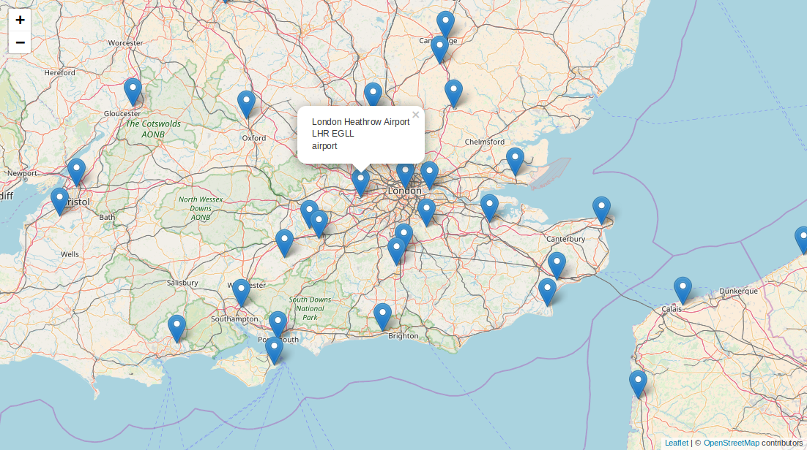

# openflights-data

> REST microservice for openflights airports and airlines data

Get airport and airline data via REST API.

## Run Example

```bash
npm install
cd example && npm install && npm run build && cd ..
npm start
```

Open http://localhost:3003



## Usage with express server

```js
const {router} = require('openflights-data')
const app = require('express')()

app.use('/', router())
app.listen(3000)
```

Just access data.

```js
const {loadData} = require('openflights-data')

loadData(config).then(data => console.log(data))
```

## API

### Get airport by IATA Code

Returns GeoJSON Feature

```js
GET /airports/iata/:code
// e.g.
GET /airports/iata/aaa

{
  type: 'Feature',
  geometry: {
    type: 'Point',
    coordinates: [-145.50999450683594, -17.35260009765625]
  },
  properties: {
    id: '1973',
    name: 'Anaa Airport',   // name of airport
    city: 'Anaa',           // city name
    iata: 'AAA',
    icao: 'NTGA',
    alt: 10,                // altitude in ft
    tz: 'Pacific/Tahiti',   // timezone
    country: 'PF',          // ISO-3166 Country Code
    type: 'airport'         // type: airport, airbase, heliport, seaplane,
                            //       airfield, bus, port, station
  }
}
```

### Get airport by ICAO Code

Returns GeoJSON Feature

```js
GET /airports/icao/:code
```

### Search airport by name

Returns GeoJSON FeatureCollection

```js
GET /airports/search/:search
// e.g.
GET /airports/search/leonardo+da

{
  type: 'FeatureCollection',
  features: [
    {
      type: 'Feature',
      geometry: {
        type: 'Point',
        coordinates: [12.2388889, 41.8002778]
      },
      properties: {
        id: '1555',
        name: 'Leonardo da Vinci–Fiumicino Airport',
        city: 'Rome',
        iata: 'FCO',
        icao: 'LIRF',
        alt: 13,
        tz: 'Europe/Rome',
        country: 'IT',
        type: 'airport'
      }
    }
  ]
}
```

### Get airports by bounding box

Returns GeoJSON FeatureCollection

```js
GET /airports/bbox/:north,:west/:south,:east
// example get all airports within lat 49, lng 8 and lat 48, lng 7
GET /airports/bbox/49,8/48,7

// filter by country, type, iata, icao
GET /airports/bbox/:north,:west/:south,:east?country=C1,C2&type=t1,t2&iata=1&icao=1
// example get all swiss airfields
GET /airports/bbox/47.54,6.38/45.73,10.77?country=CH&type=airfield
```

### Get airline by IATA code

Returns airline object

```js
GET /airlines/iata/:code
// e.g.
GET /airlines/iata/4u
{
  id: '2548',
  name: 'Germanwings',
  iata: '4U',
  icao: 'GWI',
  callsign: 'GERMAN WINGS',
  active: true,
  country: 'DE'
}
```

### Get airline by ICAO code

```js
GET /airlines/icao/:code
```

### Get airline by callsign

```js
GET /airlines/callsign/:callsign
```

### Search airline by name

Returns Array of airline objects

```js
GET /airlines/search/:search
```

## Data

Data is obtained from [openflights](https://github.com/jpatokal/openflights)
under [ODBL-1.0](http://opendatacommons.org/licenses/odbl/1.0) and downloaded as postinstall task.

If you like to improve the data please open an [issue here](https://github.com/jpatokal/openflights/issues).

## License

Unlicense https://unlicense.org
